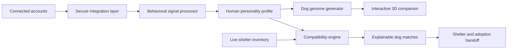

# Shepard

<p align="center">
  
</p>

<p align="center">
  <strong>Find the dog whose needs fit the life you already live.</strong>
</p>

Shepard is an intelligent dog-matching platform that turns a person’s real behavioral patterns into an explainable personality profile, creates an interactive 3D representation of their ideal companion, and matches them with compatible dogs available for adoption.

Traditional adoption platforms begin with breed, size, or appearance. Shepard begins with compatibility: routine, energy, patience, presence, social rhythm, and the kind of support each dog actually needs.

## How Shepard works

### 1. Connect your life

Users securely connect the services that reflect how they spend their time:

- Google Calendar
- Google Drive
- Slack
- Gmail
- Notion
- Dropbox
- Microsoft Teams
- Jira
- HubSpot
- Salesforce

Connections are handled through secure OAuth and Merge-powered integrations. Users choose exactly which sources Shepard can access and can disconnect or delete their data at any time.

Shepard analyzes behavioral metadata—not the private meaning of personal messages or documents. Relevant signals include schedule density, working hours, response cadence, collaboration patterns, travel frequency, routine consistency, focus windows, and periods of home availability.

### 2. Understand your personality

Shepard transforms connected activity into a clear behavioral profile describing the user’s real lifestyle.

The profile measures:

| Trait | What Shepard identifies |
|---|---|
| Patience | Response tempo, interruption patterns, and tolerance for changing demands |
| Routine stability | How predictable the user’s days and weeks are |
| Home presence | When and how consistently the user is available at home |
| Activity level | Movement, scheduling, travel, and active-time patterns |
| Social density | Collaboration frequency and the number of regular social interactions |
| Household rhythm | Whether daily life is quiet, busy, spontaneous, or structured |
| Adaptability | How the user responds to schedule changes and unexpected events |
| Attention style | Preference for deep focus, frequent interaction, or flexible switching |

Every result includes a concise explanation and an expandable evidence view showing which patterns contributed to the analysis.

### 3. Meet your digital Shepard

Shepard converts the personality profile into a multidimensional dog genome and generates a unique interactive 3D companion.

The generated dog reflects qualities such as:

- Energy
- Affection
- Independence
- Sociability
- Sensitivity
- Trainability
- Vocality
- Curiosity
- Adaptability
- Scent drive
- Preferred activity
- Need for companionship

The 3D viewer includes:

- Orbit, zoom, and direct interaction
- Animated breathing and idle movement
- A dynamic technical grid and scanning overlay
- Clickable anatomical feature points
- Trait-to-feature connections
- Coat, build, posture, and expression generation
- Expandable genome explanations
- Full reduced-motion and keyboard support

The generated dog is a personality archetype: a visual way for users to understand the temperament and lifestyle needs most compatible with them.

### 4. Find real dogs

Shepard compares the user’s profile with behavioral and care information supplied by shelters and rescue organizations.

Instead of asking whether a dog looks like the user’s preferred breed, the matching engine asks a more important question:

> Can this person consistently provide what this dog needs?

Each dog is evaluated across:

- Required patience
- Routine stability
- Time at home
- Exercise capacity
- Noise sensitivity
- Training experience
- Social environment
- Other-pet compatibility
- Child compatibility
- Medical and mobility requirements
- Housing restrictions
- Separation needs

Hard constraints are applied first. Shepard then ranks compatible dogs using an asymmetric needs-based model: failing to meet a critical need is penalized more heavily than having extra capacity.

Every result includes:

- Overall compatibility score
- Strongest compatibility factors
- Potential challenges
- Care requirements
- Shelter-provided history
- Medical and vaccination information
- Distance and availability
- A personalized explanation
- Direct adoption or shelter-contact actions

## Product journey

1. **Connect** — Select and authorize behavioral data sources.
2. **Analyze** — Watch Shepard build a privacy-preserving behavioral model.
3. **Profile** — Review a concise personality summary and expandable evidence.
4. **Create** — Generate a personalized dog genome.
5. **Meet** — Explore the interactive 3D dog and its defining features.
6. **Match** — Discover real adoptable dogs ranked by compatibility.
7. **Connect with a shelter** — Review the dog’s full profile and begin the adoption process.

## System architecture



## Explainable matching

Shepard never presents a compatibility score without context.

The matching system preserves the factors behind every recommendation, allowing users and shelters to understand:

- What makes the pairing strong
- Which needs require special attention
- Which user behaviors support the recommendation
- Whether any risks or constraints remain
- Why another dog ranked lower

AI-generated summaries make the analysis approachable, while the underlying deterministic scoring model keeps rankings stable, inspectable, and testable.

## Shelter platform

Shelters can manage and synchronize:

- Available dogs
- Behavioral assessments
- Care notes
- Medical information
- Adoption status
- Home requirements
- Compatibility constraints
- Location and application links

Dog availability updates automatically, preventing unavailable animals from appearing in active recommendations. Shelter staff can review the compatibility factors accompanying an inquiry before beginning the adoption process.

## Privacy and security

Shepard is built around informed consent and data minimization.

- Connections use OAuth; Shepard never receives account passwords.
- Every data source is independently authorized and revocable.
- Raw personal content is not retained.
- Behavioral metadata is converted into limited derived signals.
- Credentials and access tokens are encrypted.
- Data is encrypted in transit and at rest.
- Users can inspect connected sources and stored profile data.
- Account deletion removes profiles, derived signals, and connection records.
- Personal data is never sold or used for advertising.
- Shelter partners only receive information the user explicitly shares.

## Technology

Shepard is built with:

- Next.js and React
- TypeScript
- Motion for fluid, interruptible animation
- Three.js and React Three Fiber for interactive 3D
- Merge for secure integration infrastructure
- Explainable AI for personalized analysis
- A deterministic multidimensional compatibility engine
- Live shelter and rescue inventory integrations
- Automated unit, integration, accessibility, and end-to-end testing

## Local development

```bash
git clone https://github.com/unio207/dog_matcher.git
cd dog_matcher
npm install
cp .env.example .env.local
npm run dev
```

Open [http://localhost:3000](http://localhost:3000).

### Separate live Calendar integration

The production-shaped Merge integration is isolated at
[http://localhost:3000/merge-demo](http://localhost:3000/merge-demo), so the
fixture-backed presentation at `/` remains reliable.

The page requires Google OAuth plus a Merge Agent Handler Tool Pack containing
the `google-calendar` connector and its read-only `list_events` tool. Copy
`.env.example` to `.env.local` and configure:

- `AUTH_SECRET`, `AUTH_GOOGLE_ID`, and `AUTH_GOOGLE_SECRET`;
- `MERGE_AGENT_HANDLER_KEY` and `MERGE_TOOL_PACK_ID`; and
- an independent, random `MERGE_USER_ID_SECRET` of at least 32 characters.

Use `/api/auth/callback/google` as the Google OAuth callback path. Add both the
local URL and the deployed HTTPS URL to Google Cloud. Never commit `.env.local`
or paste credentials into client-side variables. Set `NEXTAUTH_URL` to the
canonical public HTTPS origin in every proxied deployment so same-origin checks
do not rely on an internal proxy URL.

Each signed-in person receives a pseudonymous, isolated Merge Registered User.
The browser receives a short-lived, single-use Link token plus an encrypted,
HttpOnly, user-bound handle needed for profile and deletion requests. The
server calls Calendar for a bounded 30-day window, immediately reduces events
to aggregate timing signals, and returns no event titles, descriptions,
locations, attendee identities, plaintext Merge user IDs, or MCP URLs. Slack
and Drive remain visibly labeled sample signals on this page.

For a public deployment, enable a distributed edge or platform rate limit in
addition to the included per-process guard. After installing deployment
secrets, complete one real Google sign-in, Calendar Link, aggregate-profile, and
account-deletion smoke test before sharing the URL.

Run validation with:

```bash
npm test
npx tsc --noEmit
npm run build
```

## Design principles

Shepard follows five product principles:

1. **Needs before aesthetics**  
   Compatibility matters more than breed preference or appearance.

2. **Behavior before self-reporting**  
   Real patterns provide a stronger foundation than a one-time personality quiz.

3. **Explanation before persuasion**  
   Users should understand why a recommendation exists.

4. **Consent before analysis**  
   Every connected source is optional, visible, and revocable.

5. **Long-term fit before fast adoption**  
   The goal is a stable relationship that works for both the person and the dog.

## Mission

Shepard exists to make dog adoption more human, more explainable, and more likely to last.

The best dog is not simply the one someone wants at first glance. It is the one whose needs fit the care, energy, patience, and companionship that person can sustainably provide.
